<p align="center">
  
</p>

<p align="center">
       
</p>


## Architecture

<p align="center">
  
</p>

| Component | Port | Role |
|---|---|---|
| `user-service` | 8001 | FastAPI. Chaos switches for errors and latency. Release `v2` has a planted 4 s latency bug. |
| `order-service` | 8002 | FastAPI. Calls user then payment (3 s timeout each). Also hosts incidents, deployments, the investigator and the dashboard. |
| `payment-service` | 8003 | FastAPI. Same pattern. Release `v2` has a planted 50% error bug. |
| `detector` | none | Polls Prometheus every 10 s. Opens an incident after 3 checks at or above 0.3 failure ratio, resolves after 3 checks below 0.1. |
| `controller` | none | The "robot". Reads each open incident, asks the rulebook what to do, and in enforce mode acts, verifies and records. Sends Telegram notices to the service owner. |
| `prometheus` | 9090 | Scrapes all three services every 5 s. |
| `grafana` | 3000 | "RootLens Observability Dashboard". |
| `jaeger` | 16686 | Distributed tracing. The three services send OpenTelemetry traces, so one slow order can be followed across every service. |
| SQLite | volume | `/data/incidents.db` in the `rootlens-data` volume. Holds incidents, deployments and the audit log. |


## Incident lifecycle

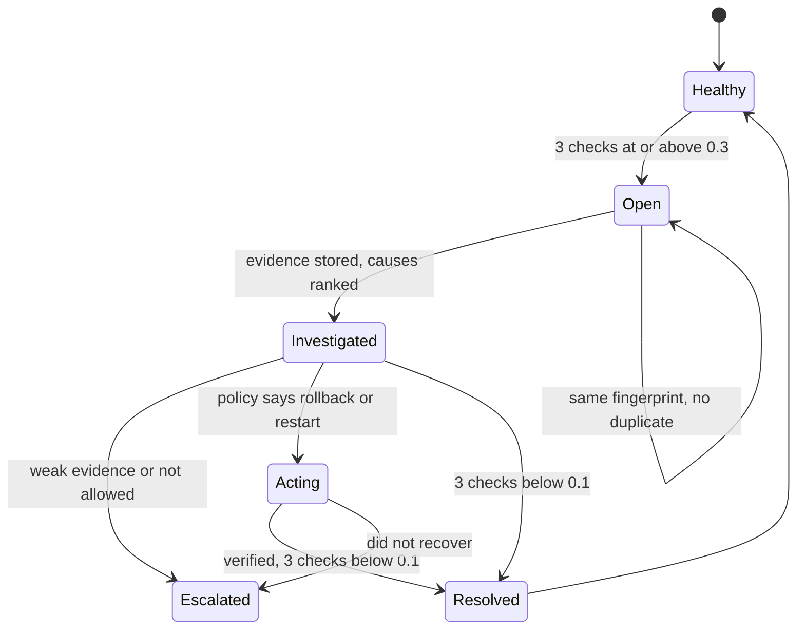
```mermaid
stateDiagram-v2
    [*] --> Healthy
    Healthy --> Open: 3 checks at or above 0.3
    Open --> Investigated: evidence stored, causes ranked
    Investigated --> Escalated: weak evidence or not allowed
    Investigated --> Acting: policy says rollback or restart
    Acting --> Resolved: verified, 3 checks below 0.1
    Acting --> Escalated: did not recover
    Investigated --> Resolved: 3 checks below 0.1
    Resolved --> Healthy
    Open --> Open: same fingerprint, no duplicate
```


## 📸 Screenshots

These come from a real run of the lab: payment-service `v2` was released at 12:25:02, and RootLens took it from there.

| | |
|---|---|
| 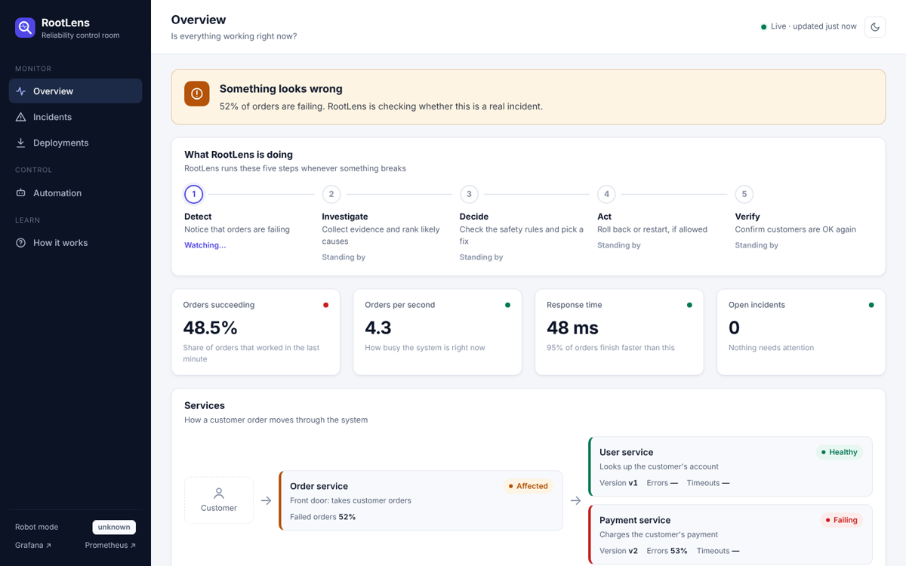 | 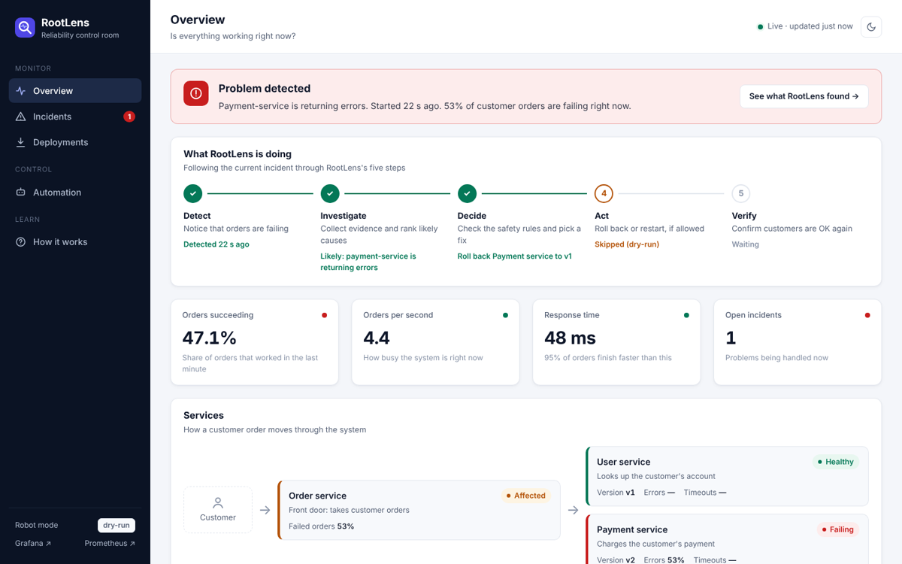 |
| **1. Something looks wrong.** 52% of orders fail. The detector is still counting checks before it opens an incident. | **2. Problem detected.** Detect, Investigate and Decide are done: payment-service is returning errors, so roll back to `v1`. |
| 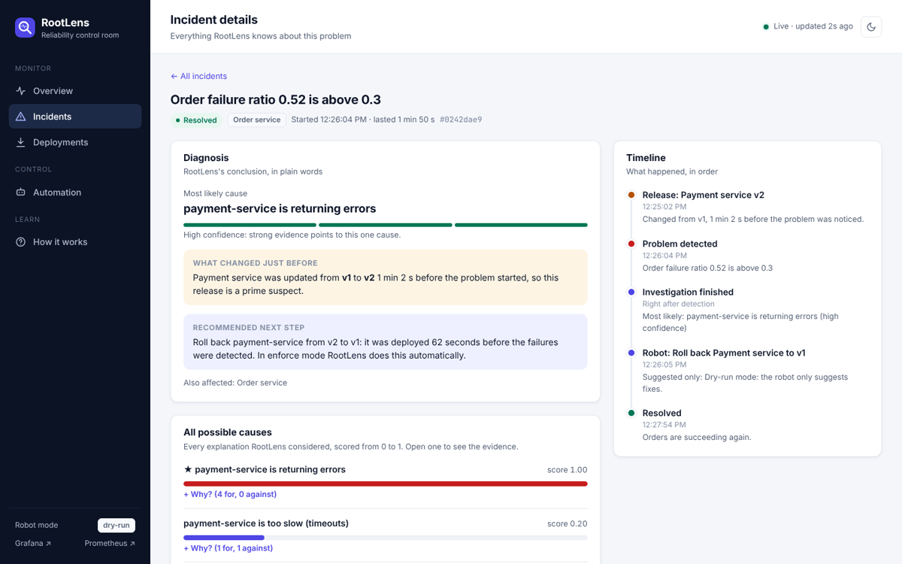 | 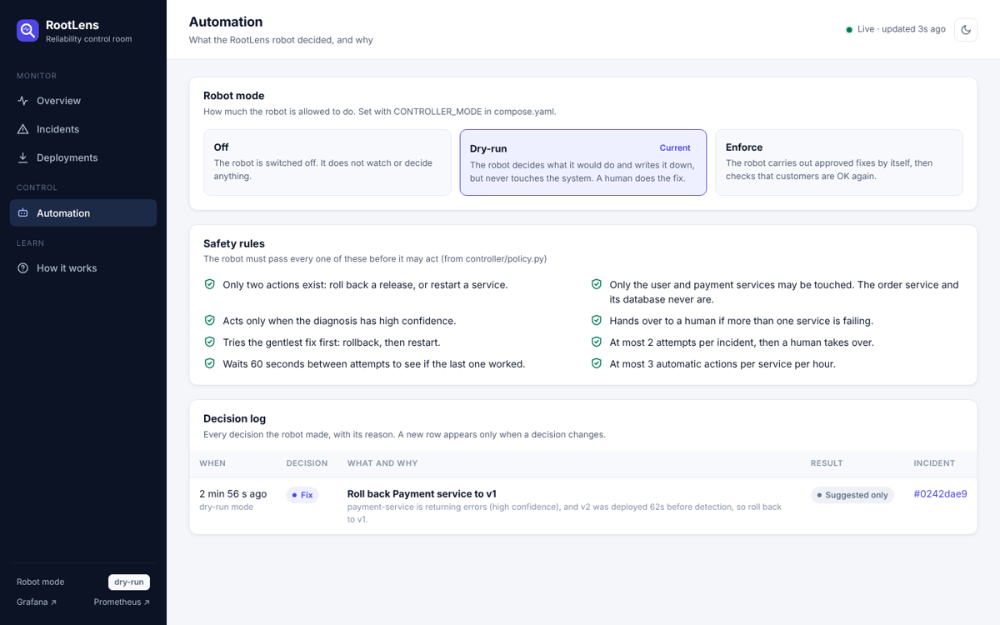 |
| **3. Incident detail.** Diagnosis (score 1.00, high confidence), what changed (`v2`, 62 s before detection), every cause considered, and the timeline. | **4. Automation.** Robot mode, the safety rules, and the decision log: "Roll back Payment service to v1" (dry-run, so suggested only). |
| 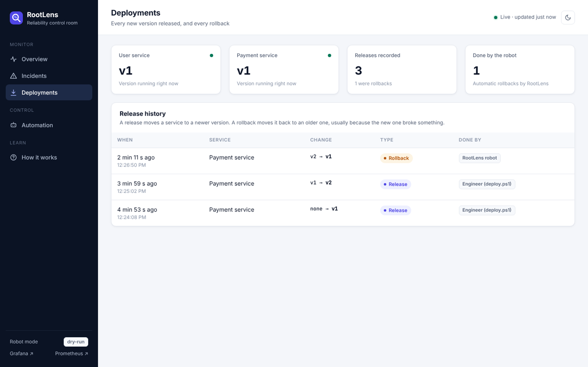 | 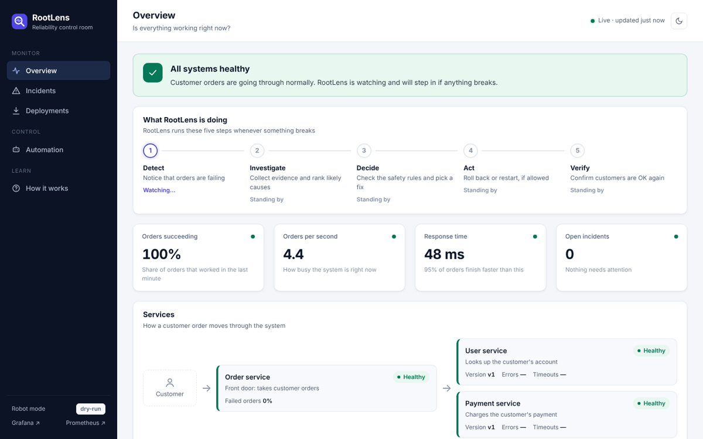 |
| **5. Deployments.** Every release and rollback is recorded, which is what the change correlation reads. | **6. Healthy again.** After the rollback, three healthy checks resolve the incident. It lasted 1 min 50 s. |

## 🧠 How it works

RootLens does what an on-call engineer does, in the same order, every time:

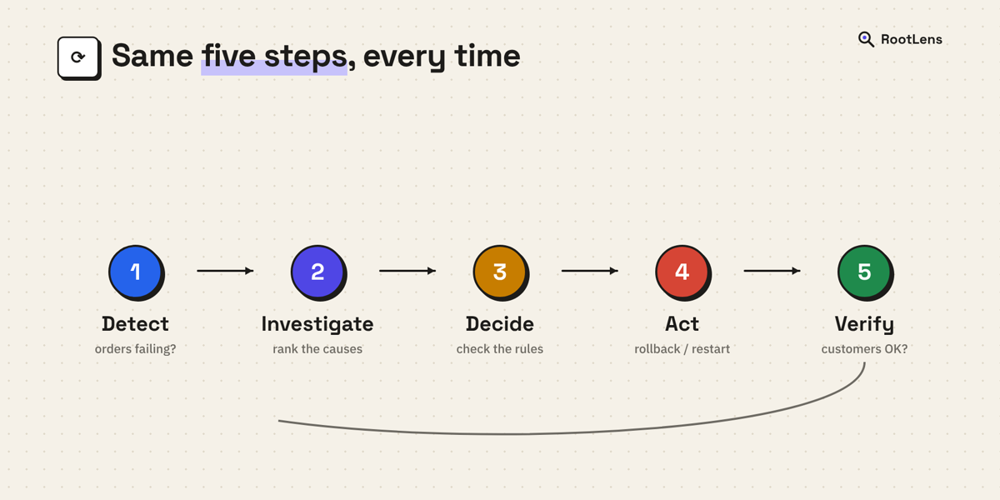

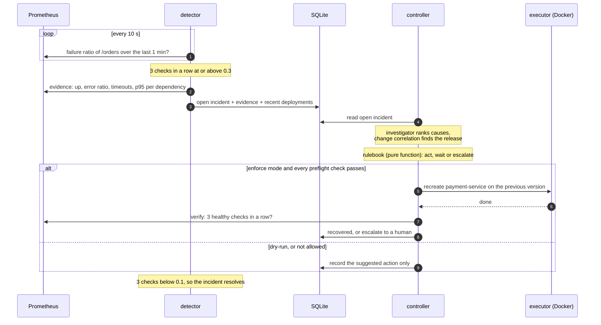
```mermaid
sequenceDiagram
    autonumber
    participant P as Prometheus
    participant D as detector
    participant DB as SQLite
    participant C as controller
    participant X as executor (Docker)
    loop every 10 s
        D->>P: failure ratio of /orders over the last 1 min?
    end
    Note over D: 3 checks in a row at or above 0.3
    D->>P: evidence: up, error ratio, timeouts, p95 per dependency
    D->>DB: open incident + evidence + recent deployments
    C->>DB: read open incident
    Note over C: investigator ranks causes,<br/>change correlation finds the release
    Note over C: rulebook (pure function): act, wait or escalate
    alt enforce mode and every preflight check passes
        C->>X: recreate payment-service on the previous version
        X-->>C: done
        C->>P: verify: 3 healthy checks in a row?
        C->>DB: recovered, or escalate to a human
    else dry-run, or not allowed
        C->>DB: record the suggested action only
    end
    Note over D: 3 checks below 0.1, so the incident resolves
```

### The lab

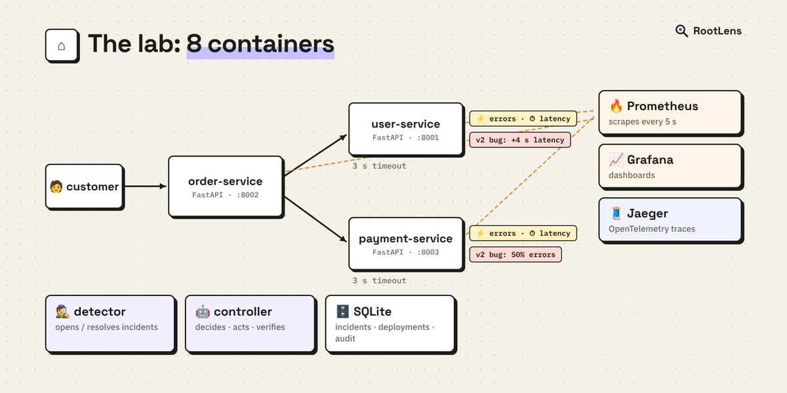

Three FastAPI services form a tiny shop. `order-service` calls `user-service` and `payment-service` with a 3 s timeout on each. Every service has fault-injection switches (errors, latency), and each `v2` release carries a deliberately planted bug: `user-service v2` adds 4 s of latency, `payment-service v2` fails 50% of requests.

### 1. Detect

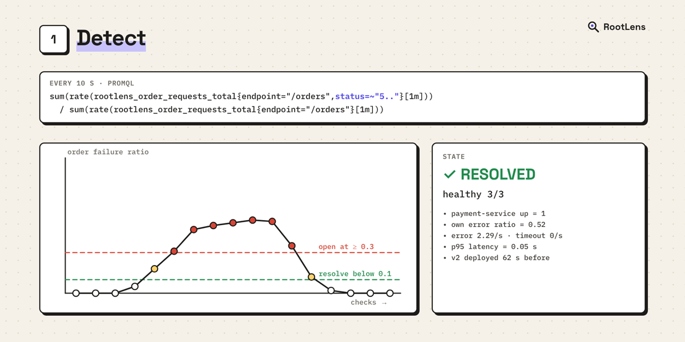

- Every 10 s the detector runs one PromQL query: the share of `/orders` requests that returned 5xx over the last minute.
- It **opens** an incident after 3 checks in a row at or above **0.3**, and **resolves** only after 3 checks in a row below **0.1**. Two thresholds (hysteresis) stop an incident from flickering open and closed.
- The moment it opens, it snapshots the evidence for each dependency: its `up` metric, its own error ratio, how calls to it failed (errors or timeouts), the p95 latency, and the deployments of the last 30 minutes.
- Incidents have a fingerprint, so the same problem never creates a duplicate.

### 2. Investigate

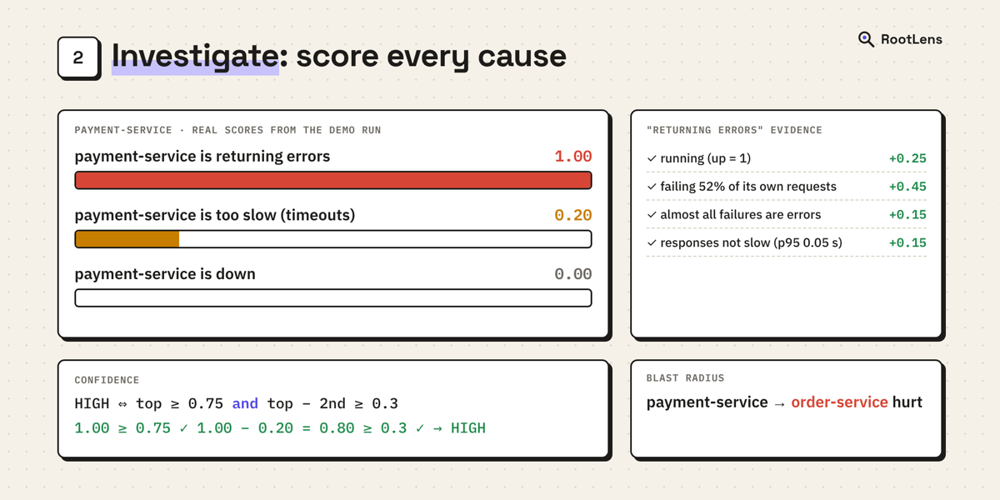

For every dependency the investigator scores three possible causes from the evidence: **down**, **returning errors**, or **too slow**. Each piece of evidence adds or subtracts points, and you can see the reasons ("4 for, 0 against") in the UI.

- **Confidence is high** only when the top cause scores at least **0.75** *and* beats the runner-up by at least **0.3**. In the real run: 1.00 vs 0.20, a gap of 0.80, so high.
- **Blast radius:** it also lists which other services depend on the culprit (here, `order-service`).

### What changed?

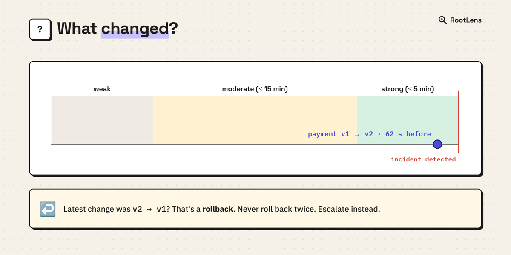

Every release is recorded in `deployments`. A release up to **5 minutes** before detection is a **strong** link, up to **15 minutes** a **moderate** one. If the latest change was itself a rollback, RootLens never rolls back twice; it escalates instead.

### 3. Decide: the rulebook

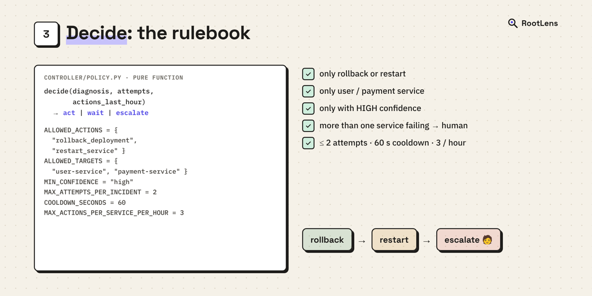

`controller/policy.py` is a **pure function**: it never touches Docker or the network, so every rule is unit-tested.

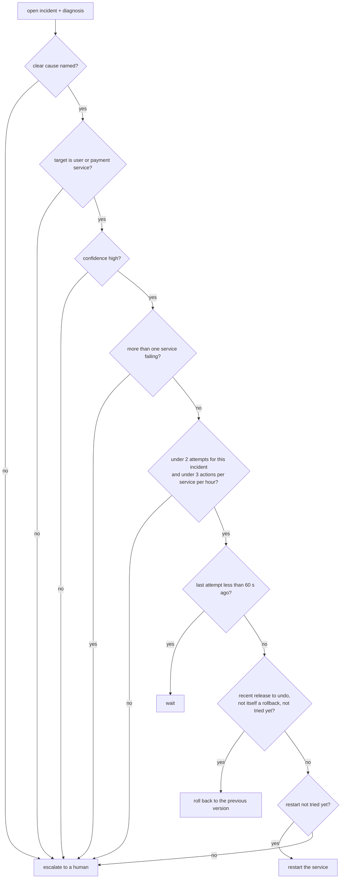
```mermaid
flowchart TD
    A[open incident + diagnosis] --> B{clear cause named?}
    B -- no --> H[escalate to a human]
    B -- yes --> C{target is user or payment service?}
    C -- no --> H
    C -- yes --> D{confidence high?}
    D -- no --> H
    D -- yes --> E{more than one service failing?}
    E -- yes --> H
    E -- no --> F{under 2 attempts for this incident<br/>and under 3 actions per service per hour?}
    F -- no --> H
    F -- yes --> G{last attempt less than 60 s ago?}
    G -- yes --> W[wait]
    G -- no --> R{recent release to undo,<br/>not itself a rollback, not tried yet?}
    R -- yes --> RB[roll back to the previous version]
    R -- no --> S{restart not tried yet?}
    S -- yes --> RS[restart the service]
    S -- no --> H
```

### 4 & 5. Act, then verify

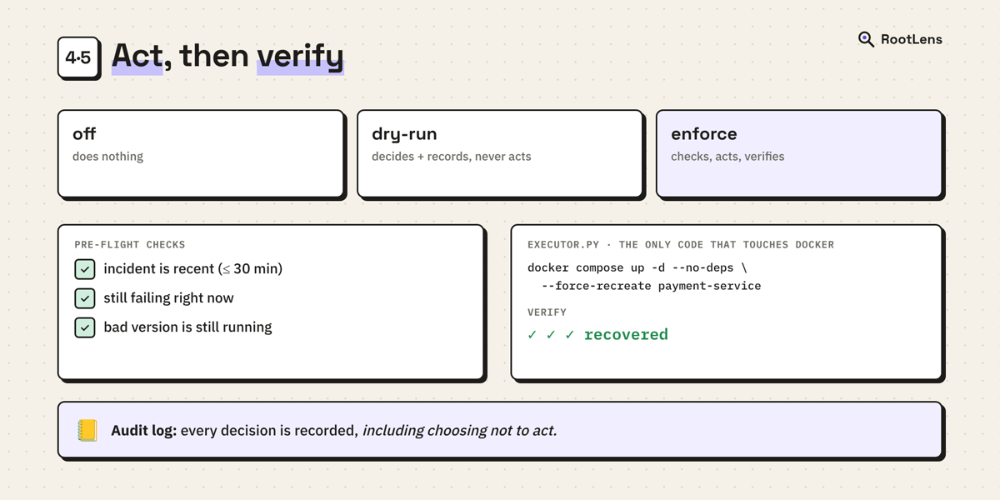

- **Modes:** `off` (does nothing), `dry-run` (decides and records, never acts) and `enforce`.
- **Preflight checks** in enforce mode: is the incident recent (30 min or less)? Is it still failing right now? Is the bad version still the one running?
- **`executor.py`** is the only code allowed to touch Docker. It recreates the service on the previous version.
- **Verify:** 3 healthy checks in a row means recovered; otherwise it escalates to a human.
- **Audit log:** every decision is recorded, including the decision *not* to act.

### A real incident, start to finish

| Time | What happened |
|---|---|
| 12:25:02 | `payment-service v2` released |
| 12:26:04 | Incident opened: order failure ratio 0.52 (62 s after the release) |
| 12:26:04 | Diagnosis: payment-service is returning errors, score 1.00 vs 0.20, high confidence, strong trigger |
| 12:26:05 | Controller decides: roll back payment-service to `v1` (dry-run, so suggested) |
| 12:26:50 | Rollback to `v1` |
| 12:27:54 | Resolved after 3 healthy checks. Total: **1 min 50 s** |


## 🌐 Hosted demo

[](https://render.com/deploy?repo=https://github.com/HemashreeVI/rootlens)

A free web host gives you one container, so `demo/run.py` runs the whole lab as processes in a single image (`demo/Dockerfile`, `render.yaml`): Prometheus, the three services, the detector, traffic, and the controller in **enforce** mode. A release train ships the buggy `payment-service v2` about every 20 minutes (the rulebook allows 3 automatic actions per service per hour), and RootLens detects it, blames the release and rolls it back on its own. The executor's `process` runtime (`EXECUTOR_RUNTIME=process`) recreates the service through the supervisor instead of `docker compose`; the policy, safety checks and audit log are the same code. Visitors get a read-only view; no Grafana, Jaeger or notifications in this mode.

## Quick start

You need Docker Desktop (WSL2), Git, Python 3 and PowerShell.

```powershell
git clone https://github.com/HemashreeVI/RootLens.git
cd RootLens
docker compose up -d
docker compose ps
```

You should see 8 containers running. Then open:

| What | URL |
|---|---|
| Live incident dashboard | http://localhost:8002/dashboard |
| Prometheus | http://localhost:9090 |
| Grafana | http://localhost:3000 |
| Jaeger (traces) | http://localhost:16686 |

> Never run `docker compose down -v`. It deletes the incident database volume.


## Try it: the failure lab

Use three terminals from the project root.

```powershell
# Terminal 1: watch the detector
docker compose logs -f detector

# Terminal 2: send fake customer traffic (about 5 requests per second)
python .\traffic.py

# Terminal 3: break something
Invoke-RestMethod -Method Post "http://localhost:8003/chaos/errors?rate=0.5"
```

Watch the dashboard. An incident opens after about 30 seconds. Then reset:

```powershell
Invoke-RestMethod -Method Post "http://localhost:8003/chaos/reset"
```

The detector log prints `RESOLVE incident` once traffic has been healthy for 3 checks. Wait about a minute before the next test so the 1-minute metrics window clears.


## Try it: bad release and rollback

Each service reads `SERVICE_VERSION` and exposes `/version`. Only `v2` contains a bug.

```powershell
.\deploy.ps1 payment-service v2   # bad release: 50% errors, incident opens
.\deploy.ps1 payment-service v1   # rollback: incident resolves
```

`deploy.ps1` updates `.env`, recreates only that container, waits for `/version`, then records the deployment through `POST /deployments`. If PowerShell blocks the script:

```powershell
powershell -ExecutionPolicy Bypass -File .\deploy.ps1 payment-service v2
```


## Try it: let the robot fix it

The controller starts in `dry-run`: it decides and records, but never acts. To let it act, set the mode and recreate it:

```powershell
# in .env
CONTROLLER_MODE=enforce

docker compose up -d controller
.\deploy.ps1 payment-service v2      # ship the bad release
docker compose logs -f controller    # watch it decide, roll back to v1 and verify
```

Every step appears in the dashboard's audit log, including the times it chose **not** to act. Set it back to `dry-run` when you are done.


## Tests and CI

```powershell
python .\order-service\test_investigator.py
python .\controller\test_policy.py
python .\controller\test_safety.py
```

118 unit tests across six files cover the investigator, the rulebook, the safety checks, the executor, the controller loop and notifications. The rulebook and safety checks are pure functions with no Docker or network access, so every rule can be tested on its own. GitHub Actions runs two jobs on every push: `test` runs all six test files, and `build` validates the compose file and builds every image.


## Project layout

```
RootLens/
├── logo.svg, banner.svg, architecture.svg   images used by this README
├── user-service/            FastAPI service with chaos switches
├── payment-service/         FastAPI service with chaos switches
├── order-service/
│   ├── app.py               API, incidents, deployments
│   ├── database.py          SQLite access
│   ├── investigator.py      root-cause ranking
│   ├── dashboard.py         live HTML dashboard
│   └── test_investigator.py unit tests
├── detector/                polls Prometheus, opens and resolves incidents
├── controller/
│   ├── policy.py            the rulebook: act or escalate (decides only)
│   ├── safety.py            pre-flight checks and recovery verification
│   ├── executor.py          the only code that changes the running system
│   ├── controller.py        the loop: decide, check, act, verify, record
│   ├── notify.py            Telegram notices to service owners
│   └── test_*.py            unit tests
├── prometheus/prometheus.yml
├── compose.yaml
├── traffic.py               fake customers
├── deploy.ps1               versioned deploy and rollback
└── .github/workflows/ci.yml
```


## Roadmap

- [x] Three FastAPI services with Docker Compose
- [x] Prometheus and Grafana
- [x] Incident database with open and resolve lifecycle
- [x] Failure lab (chaos switches)
- [x] Continuous detector with evidence collection
- [x] Multi-service root-cause ranking with blast radius
- [x] Live dashboard
- [x] Unit tests and GitHub Actions CI
- [x] Versioned releases, `deploy.ps1`, deployment records
- [x] Change correlation: link a failure to a release that went out just before it
- [x] Policy engine: a unit-tested rulebook that decides rollback, restart, or escalate
- [x] Remediation controller: off, dry-run and enforce, with pre-flight checks and recovery verification
- [x] Dashboard: per-dependency evidence, deployments, escalations, audit log
- [x] Telegram notices to each service's owner
- [x] OpenTelemetry tracing with Jaeger
- [ ] Centralized logs
- [ ] Kubernetes
- [ ] Later: LLM-written explanations grounded in evidence, PostgreSQL, API authentication, Grafana persistence, a latency-based detector, an experiment results table


## Honest notes

- The rollback is real release mechanics, but the bug in `v2` is deliberately planted. This is a simulated release pipeline on one machine.
- `POST /deployments` and the other write endpoints are not authenticated yet.
- The controller mounts the Docker socket. That is fine on one laptop, but a real system would use a narrower permission.
- Slowness that stays under the 3 s timeout is not detected yet.

<p align="center">
  
</p>
